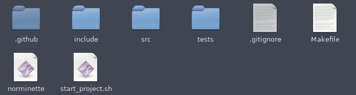

# EpitechTools
All tools for a great experiance at Epitech !

## Norminette

You can find norminette for check your coding style for C project.

You can find different version of norminette in GitHub.

It's very important to respect the norme !

Follow a norme for your push to !
ememple : `[ADD] main` - `[UPD] main` - `[DEL] .o` - `[MOV] image` - `[RENAME] mani into main`

## Script for auto start project and auto first push

### How to use

Check into the folder named `start_project`

To use the script just change the path in the script.

Then give permitions to the script with this command `chmod 777 start_project.sh`.

Finally, execute this script `./start_project.sh "gitclone repo" "name of this repo"`

exemple : `./start_project.sh git@github.com:LuciferBahamut/EpitechTools.git EpitechTools`

### Why should you use it ?

This script copy a perfect Makefile, `src` folder, `include` folder, `tests` folder for your Unit_tests, `.gitignore` file and `.github/worflows/test.yaml` to have a github action (check [this repo](https://github.com/LuciferBahamut/workshop-ga-LuciferBahamut) for an exemple of github action).

This script push automatilly the `Makefile` and `.gitignore` and create automaticly a new branch called `dev`. If you have need help with branch check [this](https://riptutorial.com/git/example/1633/creating-and-checking-out-new-branches).

If you have any questions ask to your Astek or APE.

## Create a tools folder

It's cool to have a tools folder for group all tools like this :

## To have a good intra !

## To have a good my.epitech.eu !