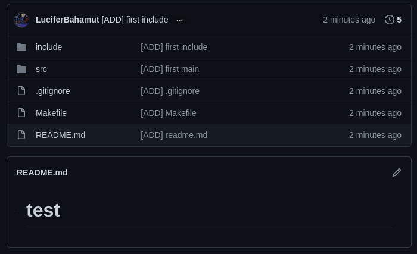

# EpitechTools
All tools for a great experience at Epitech !

Read to the end ! (There are some point - some different theme)

## Norminette

You can find a norminette to check your coding style on your C projects.

You can find different versions of norminette on GitHub.

It's very important to respect the norm ! So learn quickly to write code without the norminette !

Follow a norm for pushes too !

exemple : `[ADD] main` - `[UPD] main` - `[DEL] .o` - `[MOV] image` - `[RENAME] mani into main`

## Setup Docker Epitests

Install docker, its dependencies and to activate the docker service. You'll need:

- [docker-ce](https://docs.docker.com/engine/install/fedora/) : docker community edition
- [docker-compose](https://docs.docker.com/compose/install/) : complementary tool to simplify the creation of images and containers

### Installation

First, remove these packages if installed on your dump:

```bash
sudo dnf remove docker                   \
                docker-client            \
                docker-client-latest     \
                docker-common            \
                docker-latest            \
                docker-latest-logrotate  \
                docker-logrotate         \
                docker-selinux           \
                docker-engine-selinux    \
                docker-engine
```

Then for fedora, install `docker-ce`:

```bash
# To add the docker repository to dnf
sudo dnf -y install dnf-plugins-core
sudo dnf config-manager --add-repo https://download.docker.com/linux/fedora/docker-ce.repo

# To install docker's latest version:
sudo dnf install docker-ce docker-ce-cli containerd.io
```

> If you're not on fedora, [a tutorial for other distros is available](https://docs.docker.com/engine/install)

To install `docker-compose`:

```sh
sudo curl -L "https://github.com/docker/compose/releases/download/1.25.5/docker-compose-$(uname -s)-$(uname -m)" -o /usr/local/bin/docker-compose
sudo chmod +x /usr/local/bin/docker-compose
```

#### Enable docker

Once the installation is complete, start the docker service with `sudo systemctl start docker`

> If you want Docker to run every time you start your computer, run `sudo systemctl enable docker`

For this workshop, you have to run your docker commands with `sudo`, if you find a command on the Internet without it, it will not work without adding your user to the docker group (which requires logging out of your session, which we will not do).

#### Fedora 31+

:warning: If you are running fedora 31 or above, you'll probably have cgroups errors like:

```
docker: Error response from daemon: cgroups: cannot found cgroup mount destination: unknown.
```

To fix them, follow this [solution](https://github.com/docker/for-linux/issues/219#issuecomment-375160449) on docker's github. This solution requires to be executed each time you reboot

#### Moulinette

Finally, download the EPITECH's "moulinette" 's image with `sudo docker pull epitechcontent/epitest-docker`.

## Script to auto start a project (and auto first push)

### How to use it

Check into the folder named `tools`

To use the script just change the path in the script.

Then give permissions to the script with this command `chmod 777 start_project.sh`.

Finally, execute this script `./start_project.sh "gitclone repo" "name of this repo"`

exemple : `./start_project.sh git@github.com:LuciferBahamut/EpitechTools.git EpitechTools`

### Why should you use it ?

This script copies a perfect `Makefile`, a `src` folder with a main for your language (C or C++), a `include` folder with an include, a `tests` folder for your Unit_tests (that you should write ;) ), `.gitignore` file and `.github/worflows/test.yaml` to have a github action (check [this repo](https://github.com/LuciferBahamut/workshop-ga-LuciferBahamut) for an exemple of github action).

With this script you can choose your language to have the good Makefile - main and include in your project. You can also enter the binary name of your project and it is directly added in your Makefile

This script automatically pushes the `Makefile`, `.gitignore`, `Readme.md`, `src/main.c` or `src/Main.cpp` and `include/main.h` or `include/Main.hpp` and create automatically a new branch called `dev`. If you need help with branches check [this](https://riptutorial.com/git/example/1633/creating-and-checking-out-new-branches).

If you have any questions ask them to your Astek or APE.

Here is the result :



## Create a tools folder

It's cool to have a tools folder to group all tools like this :


This script creates automatically the tools folder at HOME (equivalent of `cd`) and creates `delivery/tools` folder

## Install ZSH
Is the best terminal better when bash (sorry to purists)

ZSH add some colors and indicates the branch you work on in your promt terminal.

You can use tab to complete commands too !

Command to install Zsh :
`$ sh -c "$(curl -fsSL https://raw.github.com/ohmyzsh/ohmyzsh/master/tools/install.sh)"`

You can find more information [here](https://ohmyz.sh/#install)

## Install Visual Studio Code
You can install Visual Studio Code on your computer but only if you can debug your code by yourself. VSCode has a debugger mode and some extensions and IT IS VERY IMPORTANT to know how to debug your code without a debugger.

VSCode is great to switch between files when you are working, instead of opening and closing your files.

You can find some extensions for all languages to debug or auto-completion.
And you can personalise your terminal ! (glassIt Vs :) to have a semi-transparent interface and you can read your subject(s) while you are working)
And you can see which file was modified or not etc.

You can install Vscode with this command :
`sudo dnf install code`

To run Vscode use the command `code ./` (with a folder as an argument)

## To have a good intra !

### Use stylish extension

You can find this extension for chrome and firefox.

With this extension you can apply a theme on your intra !

I use [this theme](https://userstyles.org/styles/136022/epitech-flat-intranet)

### Use an extension to show your XP HUB !

You can find all information on [the original GitHub](https://github.com/NialaH/intraxphub_chrome)

### Alert activity

This Chrome extension can alert you before an activity, it's cool to skip a -21 :)

You can find it [here](https://chrome.google.com/webstore/detail/epitech-manager/jekeepplfbimflieidnckjigmmnjaadm?hl=fr)

### Sync your planning

You can find many GitHubs or extensions to link your planning on the intra and your Google calendar or Outlook calendar

## To have a good my.epitech.eu !

### Add percentage to the projects

Before 2021 my.epitech.eu had a percentage for each project. 

It's been deleted because students were clinging on it too much and gave up on the idea to pass as much tests as possible in as much categories as possible whereas just making an error handling and get 50% on the project (yes it can happen...)

You can find this theme [here](https://github.com/alwyn974/MyEpitechExt)

## Create your style or extension

You can create your own style just learn the languages and do it ! (you can find intra API on GitHub)

You can make this project count for your scholarship by making it a Project Maker or a Project Bidouille


Good luck to you and work hard :)
