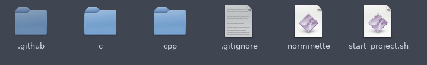

# EpitechTools
All tools for a great experience at Epitech !

## Norminette

You can find a norminette to check your coding style on your C projects.

You can find different versions of norminette on GitHub.

It's very important to respect the norm ! So learn quickly to write code without the norminette !

Follow a norm for pushes too !

exemple : `[ADD] main` - `[UPD] main` - `[DEL] .o` - `[MOV] image` - `[RENAME] mani into main`

## Script to auto start a project (and auto first push)

### How to use it

Check into the folder named `start_project`

To use the script just change the path in the script.

Then give permissions to the script with this command `chmod 777 start_project.sh`.

Finally, execute this script `./start_project.sh "gitclone repo" "name of this repo"`

exemple : `./start_project.sh git@github.com:LuciferBahamut/EpitechTools.git EpitechTools`

### Why should you use it ?

This script copies a perfect `Makefile`, a `src` folder with a main for your language (C or C++), a `include` folder with an include, a `tests` folder for your Unit_tests (that you should write ;) ), `.gitignore` file and `.github/worflows/test.yaml` to have a github action (check [this repo](https://github.com/LuciferBahamut/workshop-ga-LuciferBahamut) for an exemple of github action).

With this script you can choose your language to have the good Makefile - main and include in your project. You can also enter the binary name of your project and it is directly added in your Makefile

This script automatically pushes the `Makefile`, `.gitignore`, `Readme.md`, `src/main.c` or `src/Main.cpp` and `include/main.h` or `include/Main.hpp` and create automatically a new branch called `dev`. If you need help with branches check [this](https://riptutorial.com/git/example/1633/creating-and-checking-out-new-branches).

Then look the result :

If you have any questions ask them to your Astek or APE.

## Create a tools folder

It's cool to have a tools folder to group all tools like this :

## To have a good intra !

### Use stylish extension

You can find this extension for chrome and firefox.

With this extension you can apply a theme on your intra !

I use [this theme](https://userstyles.org/styles/136022/epitech-flat-intranet)

### Use an extension to show your XP HUB !

You can find all information on [the original GitHub](https://github.com/NialaH/intraxphub_chrome)

### Alert activity

This Chrome extension can alert you before an activity, it's cool to skip a -21 :)

You can find it [here](https://chrome.google.com/webstore/detail/epitech-manager/jekeepplfbimflieidnckjigmmnjaadm?hl=fr)

### Sync your planning

You can find many GitHubs or extensions to link your planning on the intra and your Google calendar or Outlook calendar

## To have a good my.epitech.eu !

### Add percentage to the projects

Before 2021 my.epitech.eu had a percentage for each project. 

It's been deleted because students were clinging on it too much and gave up on the idea to pass as much tests as possible in as much categories as possible whereas just making an error handling and get 50% on the project (yes it can happen...)

You can find this theme [here](https://github.com/alwyn974/MyEpitechExt)

## Create your style or extension

You can create your own style just learn the languages and do it ! (you can find intra API on GitHub)

You can make this project count for your scholarship by making it a Project Maker or a Project Bidouille

Good luck to you and work hard :)
